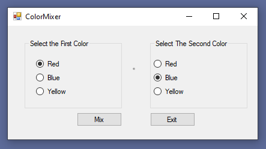

# Color Mixer

The colors red, blue, and yellow are known as the primary colors because they cannot be made by mixing
other colors. When you mix two primary colors, you get a secondary color, as shown here:
- When you mix red and blue, you get purple.
- When you mix red and yellow, you get orange.
- When you mix blue and yellow, you get green.

Create an application that lets the user select two primary colors from two different sets of radio buttons.
The form should also have a mix button, the form's background should change to the color that you get when
you mix the two selected primary colors. The form should look exactly like the one below:

### Evaluation Criteria
- Variables and control names
- Default selections made
- Proper form background colors displayed
- Format, Readability, Organization
- Comments/Documentation - Include author information!
